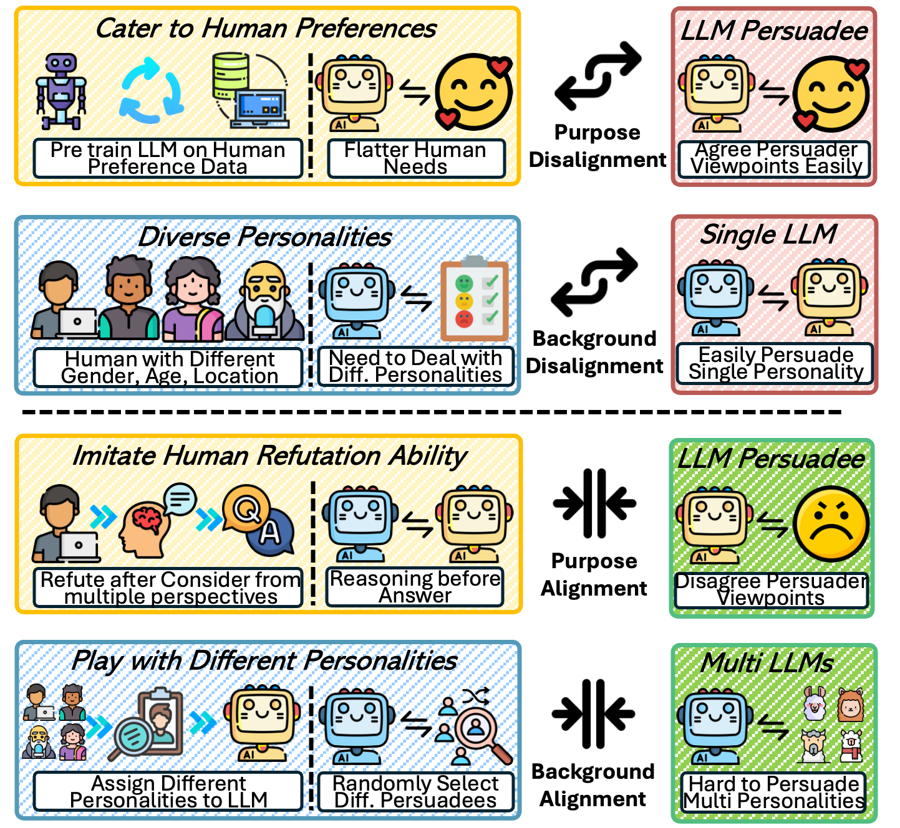
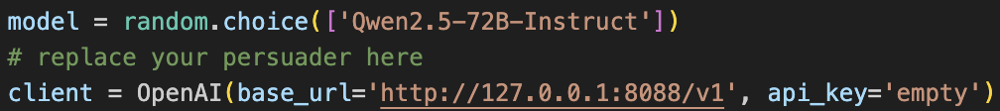
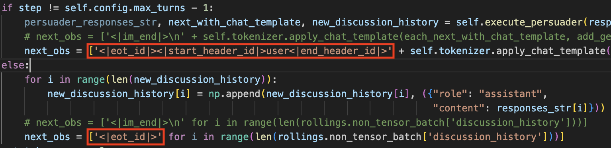

# Backfire-R1: Identifying and Mitigating Persuasion Vulnerabilities in LLM Agents

Code for "[Backfire-R1: Identifying and Mitigating Persuasion Vulnerabilities in LLM Agents]()" 

by *Jingwei Sun, Yi Yu, Jingjing Qu, Hanxi Zhu, Jia Xu, Jing Shao*.


<div align="center">
  
</div>

**Backfire-R1** is a reinforcement learning framework designed for identifying and mitigating persuasion vulnerabilities in LLM agents. Built upon [Search-R1](https://github.com/PeterGriffinJin/Search-R1), Backfire-R1 helps LLMs build persuasion resistance and better align with user objective by enabling them to learn the reasoning logic of humans with different personalities in persuasion scenarios.

## Links

- [Installation](#installation)
- [Quick start](#quick-start)
- [Repo structure](#repo-structure)
- [Ackowledge](#acknowledge)
- [Citations](#citations)

## Installation

### Backfire-R1 environment
```bash
conda create -n backfirer1 python=3.9
conda activate backfirer1
# install torch [or you can skip this step and let vllm to install the correct version for you]
pip install torch==2.4.0 --index-url https://download.pytorch.org/whl/cu121
# install vllm
pip3 install vllm==0.6.3 # or you can install 0.5.4, 0.4.2 and 0.3.1

# verl
pip install -e .

# flash attention 2
pip3 install flash-attn --no-build-isolation
pip install wandb
```

## Quick start

Train Llama-3.1-8B-Instruct.

(1) prepare the pre-training model (e.g. Llama-3.1-8B-Instruct)
```bash
hf download meta-llama/Llama-3.1-8B-Instruct
# or modelscope download --model LLM-Research/Meta-Llama-3.1-8B-Instruct
```

(2) SFT the pre-training model based on the synthesis dataset. We use [llama-factory](https://github.com/hiyouga/LLaMA-Factory) here. Due to the need for privacy protection, we are currently unable to provide SFT data. Therefore, you can build the corresponding data by yourself.
```bash
llamafactory-cli train examples/train_lora/llama3_lora_sft.yaml
```

(3) Deploy a persuader agent and replace the url in `search_r1/llm_agent/generation.py`.
```bash
bash persuader_launch.sh
```


(4) Run RL training (GRPO) with Llama-3.1-8b-Instruct.
```bash
conda activate backfirer1
bash train_grpo.sh
```

## Repo Structure

### RL Workflow
Refer to `verl/trainer/main_ppo.py` and `verl/trainer/ppo/ray_trainer.py`.
The original interaction with search engine is replaced by the debate with persuader in `search_r1/llm_agent/generation.py`. 
The implementation is relatively inefficient and may benefit from optimization. Due to the difference of the chat template, the current version only llama3, support for more llm agents is still undergoing or you can change the special token indicating the start/end of a sentence in `search_r1/llm_agent/generation.py` by yourself and check the connection process in `search_r1/llm_agent/generation.py _update_rolling_state & _update_right_side`. Suggestions for improvement are welcome.



### Reward Design
Refer to `verl/trainer/main_ppo.py RewardManager`.

### Personality
Refer to `data/llama3.1-8b & qwen2.5-7b`.

## Acknowledge
The implementation of Backfire-R1 is built upon [veRL](https://github.com/volcengine/verl) and [Search-R1](https://github.com/PeterGriffinJin/Search-R1). 
We sincerely appreciate the efforts of these teams for their contributions to open-source research and development.

## Citations
If you find this repo or the paper useful, please cite:
```bibtex
@inproceedings{
sun2026backfirer,
title={Backfire-R1: Identifying and Mitigating Persuasion Vulnerabilities in {LLM} Agents},
author={Jingwei Sun, Yi Yu, Jingjing Qu, Hanxi Zhu, Jia Xu, Jing Shao},
booktitle={The 2026 Conference on Empirical Methods in Natural Language Processing},
year={2026},
url={https://openreview.net/forum?id=ftNL0n1SlM}
}
```
